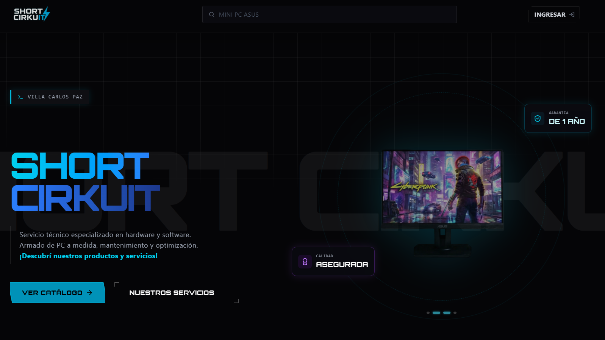
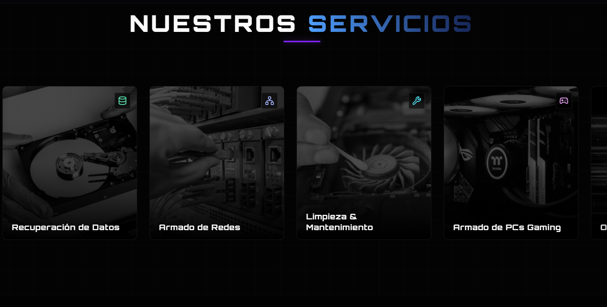
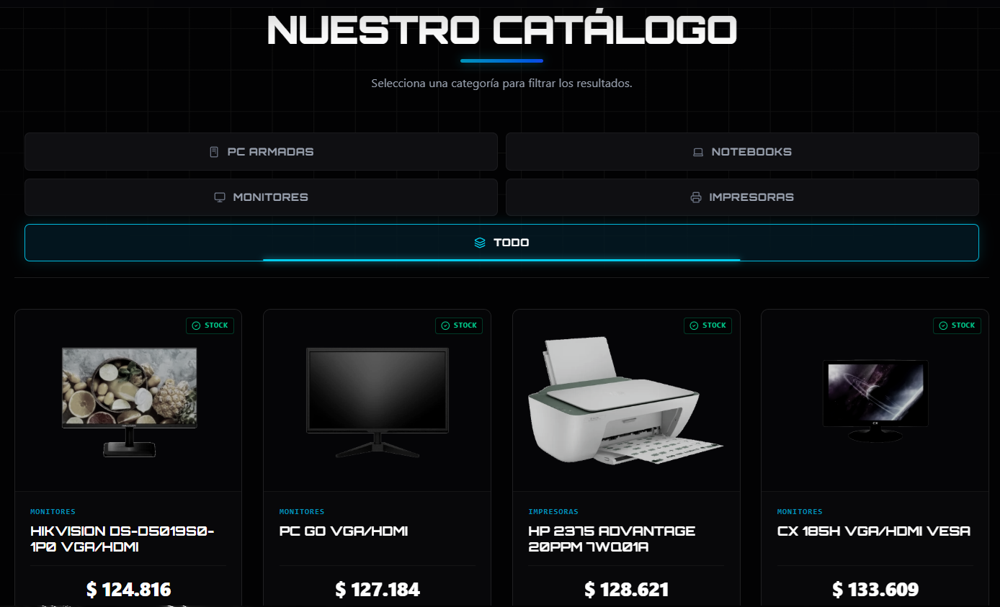
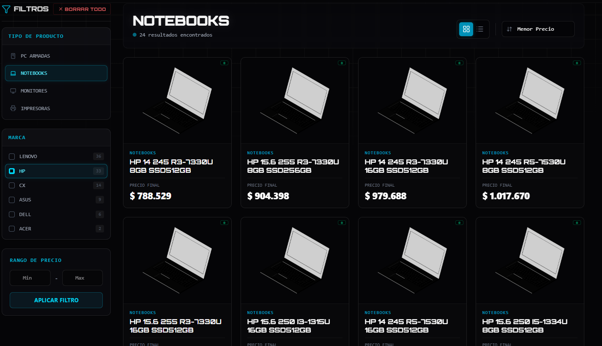
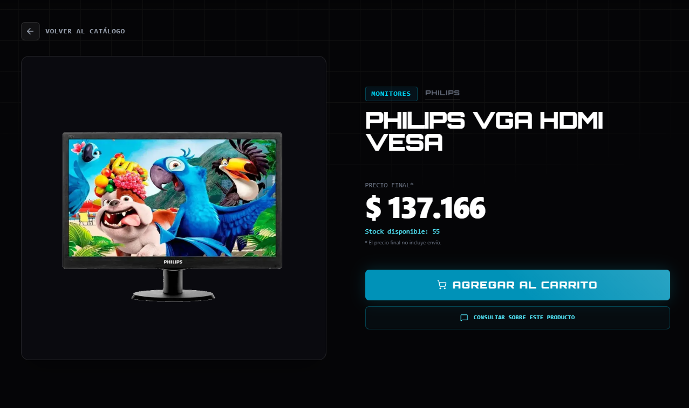
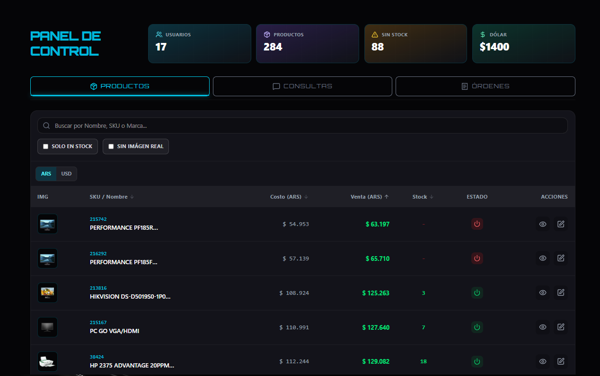
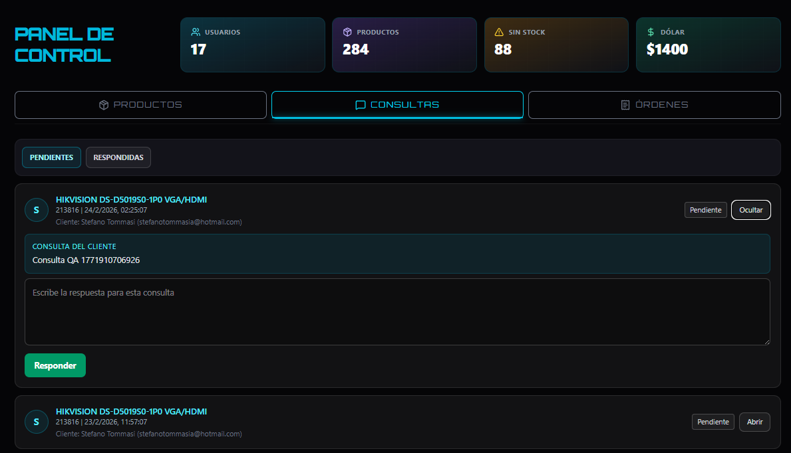
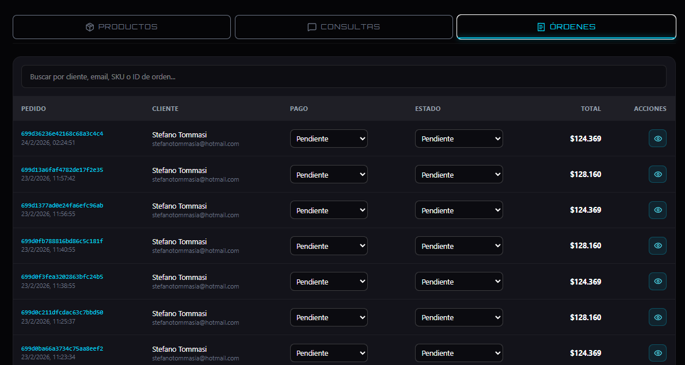

# Short Cirkuit Reskin

Reskin completo de la web de un servicio técnico familiar, llevado desde una versión con estilos básicos a una experiencia moderna, responsive y con funcionalidades de negocio reales.

El proyecto no es solo "cambio visual": incluye autenticación, catálogo, carrito, checkout, panel administrativo, consultas, recuperación de contraseña por email y sincronización automática de productos.

## Qué es y qué problema resuelve

Short Cirkuit es una web para un servicio técnico / venta de insumos y equipos de informática. Este reskin busca resolver dos frentes:

- `Imagen y confianza`: una interfaz más profesional mejora la percepción del servicio y la conversión.
- `Operación diaria`: herramientas reales para administrar productos, órdenes y consultas sin depender de procesos manuales.

En términos prácticos:

- El cliente puede navegar un catálogo, registrarse, consultar productos y generar pedidos.
- El negocio puede gestionar productos, órdenes e indicadores desde un panel admin.
- El catálogo puede sincronizarse automáticamente desde un CSV del proveedor.


## Funcionalidades principales

### Frontend (experiencia de usuario)

- Home con hero, servicios y previews de catálogo.
- Catálogo con filtros dinámicos, búsqueda y paginación.
- Detalle de producto con galería e interfaz de consulta.
- Carrito y checkout.
- Perfil de usuario con historial de órdenes y consultas.
- Autenticación tradicional + Google.
- Flujos de "Olvidé mi contraseña" y "Restablecer contraseña".
- Panel de administración con tablas, métricas y modales.
- Diseño responsive y UI más pulida que la versión original.

### Backend (lógica de negocio)

- API REST con Express.
- Autenticación con JWT + middleware de protección.
- Validación con Zod.
- Persistencia con Prisma + MongoDB.
- Gestión de carrito, órdenes, productos, categorías, filtros y consultas.
- Envío de emails de recuperación con Resend.
- Sincronización de catálogo desde CSV de proveedor.
- Endpoint interno protegido para cron de sincronización.

## Stack tecnológico

### Frontend

- `React + Vite`
- `Tailwind CSS`
- `Axios`

### Backend

- `Node.js`
- `Express`
- `TypeScript`
- `Prisma ORM`
- `MongoDB`
- `Resend`
- `Cloudinary`

### Infra / Deploy

- `Vercel`
- `Resend`

## Arquitectura del proyecto

Este repositorio tiene una carpeta raíz de Git y el código de la app dentro de `short-cirkuit/`.

```text
.           
└─ short-cirkuit/
   ├─ frontend/              
   ├─ backend/               
   ├─ api/     
   ├─ vercel.json            
   └─ package.json       
   ├─ README.md                 
├─ docs/               
   ├─ images/      
```

### Organización de directorios (detalle)

#### `short-cirkuit/frontend/src`

- `pages/`: páginas principales (Home, Catálogo, Checkout, Admin, Auth, Perfil).
- `components/`: componentes por dominio (`admin`, `catalog`, `checkout`, `products`, `auth`, etc.).
- `hooks/`: lógica reusable por feature (auth, checkout, profile, admin).
- `context/`: estado global (auth, carrito, moneda).
- `api/`: cliente Axios y funciones de acceso a la API.
- `data/`: datos estáticos para hero, servicios y categorías.
- `routes/`: configuración de rutas.
- `utils/`: helpers de formateo, errores, paginación y pricing.

#### `short-cirkuit/backend/src`

- `routes/`: endpoints REST por recurso.
- `controllers/`: lógica de negocio (ej. auth, inquiries).
- `middleware/`: auth middleware.
- `schemas/`: validaciones con Zod.
- `utils/`: helpers de auth, mailer, imágenes, dólar, órdenes, catálogo.
- `jobs/`: sincronización de catálogo por CSV.
- `config/`: constantes del catálogo.
- `prisma.ts`: instancia compartida de Prisma.
- `app.ts` / `index.ts`: inicialización de Express.

#### `short-cirkuit/backend/prisma`

- `schema.prisma`: modelos de negocio (usuarios, productos, carrito, órdenes, consultas, config del sistema).

## Modelo funcional (alto nivel)

- `Usuarios`: registro/login tradicional y Google, perfil y cambio de contraseña.
- `Productos`: catálogo sincronizable, stock, precio, categoría, marca, galería.
- `Carrito`: items por usuario con cantidades.
- `Órdenes`: checkout, estado, subtotal USD/ARS, tipo de pago local, link a WhatsApp.
- `Consultas`: mensajes por producto y respuesta administrativa.
- `Sistema`: configuración (por ejemplo, valores numéricos de negocio).

## Desarrollo local

### Requisitos

- `Node.js` (recomendado: LTS actual)
- `npm`
- `MongoDB` accesible (local o cloud)

### Instalación

Desde `short-cirkuit/`:

```bash
npm install
```

### Backend

```bash
cd backend
cp .env.example .env
npm run db:generate
npm run db:push
npm run dev
```

### Frontend

```bash
cd frontend
cp .env.example .env
npm run dev
```

## Estado del proyecto

Proyecto funcional y estable para uso real, con foco en:

- mejora visual (reskin),
- experiencia de usuario,
- flujo de ventas/consultas,
- y herramientas administrativas.

### Home


### Home - Servicios


### Home - Catálogo


### Catálogo


### Detalle de producto


### Panel de Admin - Productos


### Panel de Admin - Consultas


### Panel de Admin - Pedidos
